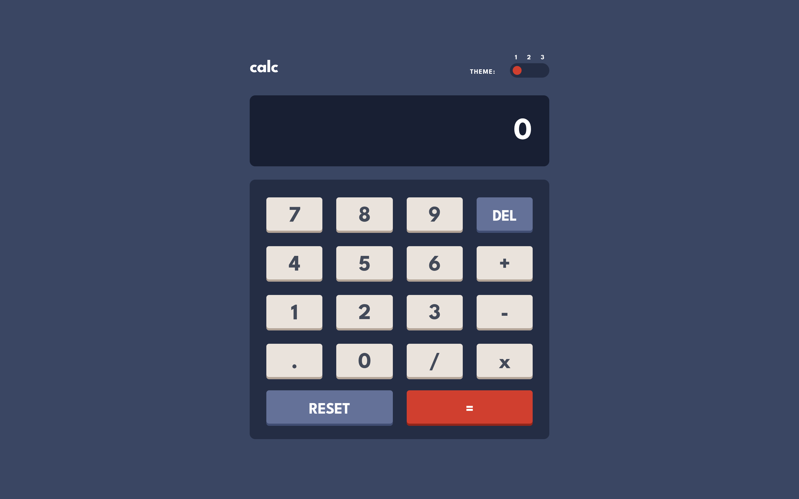
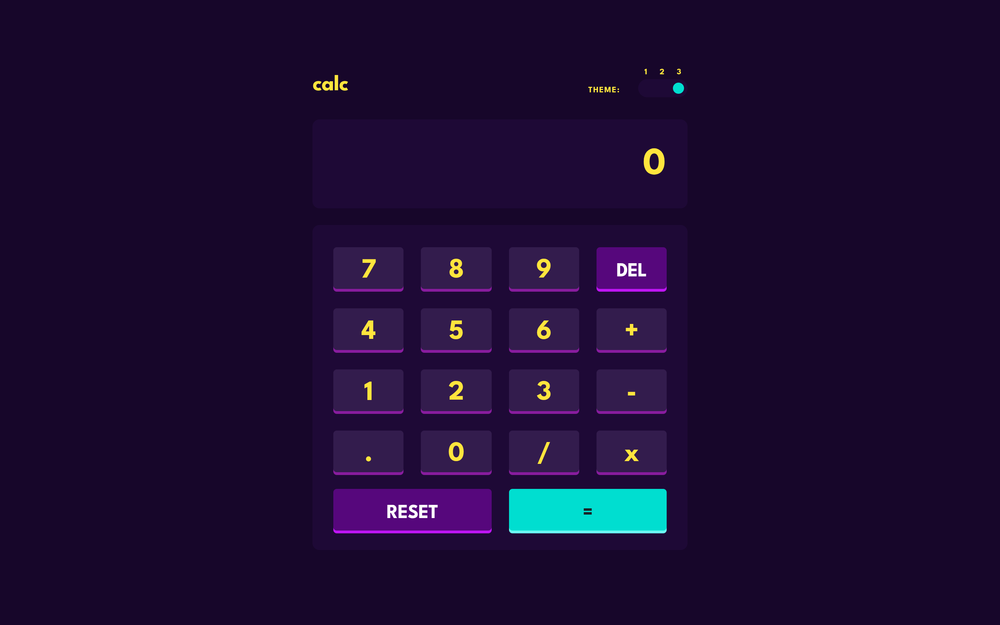
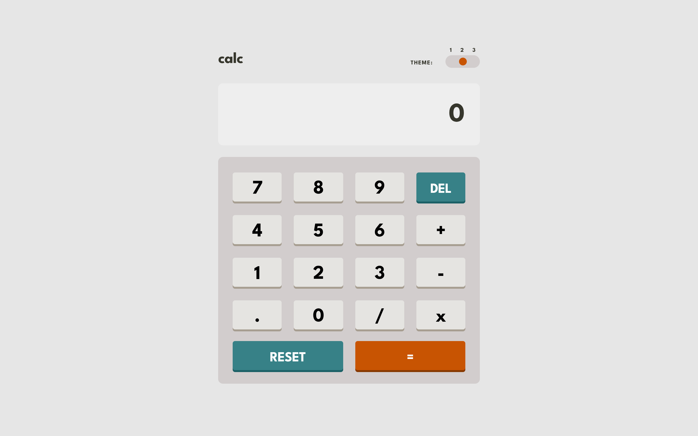

# Frontend Mentor - Calculator app solution

This is a solution to the [Calculator app challenge on Frontend Mentor](https://www.frontendmentor.io/challenges/calculator-app-9lteq5N29). Frontend Mentor challenges help you improve your coding skills by building realistic projects.

## Table of contents

- [Overview](#overview)
  - [The challenge](#the-challenge)
  - [Screenshot](#screenshot)
  - [Links](#links)
- [My process](#my-process)
  - [Built with](#built-with)
  - [Useful resources](#useful-resources)
- [Author](#author)

## Overview

### The challenge

Users should be able to:

- See the size of the elements adjust based on their device's screen size
- Perform mathmatical operations like addition, subtraction, multiplication, and division
- Adjust the color theme based on their preference
- **Bonus**: Have their initial theme preference checked using `prefers-color-scheme` and have any additional changes saved in the browser

### Screenshot

### Links

- Solution URL: [GitHub Repository](https://github.com/feMoraes0/frontend-mentor-calculator-app)
- Live Site URL: [Vercel Live URL](https://frontend-mentor-calculator-app-plum.vercel.app/)

## My process

### Built with

- Semantic HTML5 markup
- Flexbox
- CSS Grid
- Mobile-first workflow
- [React](https://reactjs.org/) - JS library
- [TailwindCSS](https://tailwindcss.com/) - For styles
- [TypeScript](https://www.typescriptlang.org/) - Type definition

<!-- ### Continued development

Use this section to outline areas that you want to continue focusing on in future projects. These could be concepts you're still not completely comfortable with or techniques you found useful that you want to refine and perfect.

**Note: Delete this note and the content within this section and replace with your own plans for continued development.** -->

### Useful resources

- [TailwindCSS: Adding custom variants](https://tailwindcss.com/docs/adding-custom-styles#adding-custom-variants) - This part of the official documentation helped me understand how to create variants for each theme used without conditional code complexity.

## Author

- GitHub - [feMoraes0](https://github.com/feMoraes0)
- Frontend Mentor - [@feMoraes0](https://www.frontendmentor.io/profile/feMoraes0)
